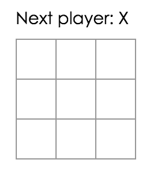
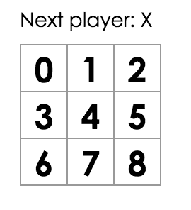
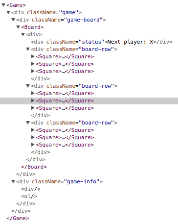

This project was bootstrapped with [Create React App](https://github.com/facebook/create-react-app).

## Available Scripts

In the project directory, you can run:

### `npm start`

Runs the app in the development mode.<br>
Open [http://localhost:3000](http://localhost:3000) to view it in the browser.

The page will reload if you make edits.<br>
You will also see any lint errors in the console.

### `npm test`

Launches the test runner in the interactive watch mode.<br>
See the section about [running tests](https://facebook.github.io/create-react-app/docs/running-tests) for more information.

### `npm run build`

Builds the app for production to the `build` folder.<br>
It correctly bundles React in production mode and optimizes the build for the best performance.

The build is minified and the filenames include the hashes.<br>
Your app is ready to be deployed!

See the section about [deployment](https://facebook.github.io/create-react-app/docs/deployment) for more information.

### `npm run eject`

**Note: this is a one-way operation. Once you `eject`, you can’t go back!**

If you aren’t satisfied with the build tool and configuration choices, you can `eject` at any time. This command will remove the single build dependency from your project.

Instead, it will copy all the configuration files and the transitive dependencies (Webpack, Babel, ESLint, etc) right into your project so you have full control over them. All of the commands except `eject` will still work, but they will point to the copied scripts so you can tweak them. At this point you’re on your own.

You don’t have to ever use `eject`. The curated feature set is suitable for small and middle deployments, and you shouldn’t feel obligated to use this feature. However we understand that this tool wouldn’t be useful if you couldn’t customize it when you are ready for it.

## Learn More

You can learn more in the [Create React App documentation](https://facebook.github.io/create-react-app/docs/getting-started).

To learn React, check out the [React documentation](https://reactjs.org/).

### Code Splitting

This section has moved here: https://facebook.github.io/create-react-app/docs/code-splitting

### Analyzing the Bundle Size

This section has moved here: https://facebook.github.io/create-react-app/docs/analyzing-the-bundle-size

### Making a Progressive Web App

This section has moved here: https://facebook.github.io/create-react-app/docs/making-a-progressive-web-app

### Advanced Configuration

This section has moved here: https://facebook.github.io/create-react-app/docs/advanced-configuration

### Deployment

This section has moved here: https://facebook.github.io/create-react-app/docs/deployment

### `npm run build` fails to minify

This section has moved here: https://facebook.github.io/create-react-app/docs/troubleshooting#npm-run-build-fails-to-minify


# [React 공식 튜토리얼](https://reactjs.org/tutorial/tutorial.html)


## 시작하기 전에

### 무엇을 구현할 것인가

대화형 틱택토 게임을 구현하려고 합니다.

원한다면 최종 결과물을 [여기](https://codepen.io/gaearon/pen/gWWZgR?editors=0010)에서 확인할 수 있습니다. 아직 코드가 이해되지 않거나 문법이 낯설어도 걱정하지 마세요. 튜토리얼에서 차근차근 틱택토 게임을 구현하는 방법을 배울테니까요.

게임을 플레이해보세요. 이동 리스트에 있는 버튼을 클릭하여 클릭한 때로 돌아가고, 그 때로 돌아간 후 보드가 어떻게 보이는지 확인할 수 있습니다.

게임에 익숙해지셨다면 탭을 닫으세요. 다음 섹션에서 간단한 템플릿을 가지고 시작할 것입니다.


#### 사전 준비

HTML과 JavaScript에 익숙할 것으로 생각합니다. 하지만 HTML과 JavaScript를 사용해본 적이 없더라도 튜토리얼을 따를 수 있어야 합니다.

JavaScript를 다시 봐야한다면 [이 가이드](https://developer.mozilla.org/en-US/docs/Web/JavaScript/A_re-introduction_to_JavaScript)를 추천합니다. 튜토리얼에서 JavaScript의 최신 버전인 ES6의 몇 가지 특징들인 [화살표 함수](https://developer.mozilla.org/en-US/docs/Web/JavaScript/Reference/Functions/Arrow_functions), [클래스](https://developer.mozilla.org/en-US/docs/Web/JavaScript/Reference/Classes), [let](https://developer.mozilla.org/en-US/docs/Web/JavaScript/Reference/Statements/let), [const](https://developer.mozilla.org/en-US/docs/Web/JavaScript/Reference/Statements/const)를 사용할 것입니다. [Babel REPL](https://babeljs.io/repl/#?presets=react&code_lz=MYewdgzgLgBApgGzgWzmWBeGAeAFgRgD4AJRBEAGhgHcQAnBAEwEJsB6AwgbgChRJY_KAEMAlmDh0YWRiGABXVOgB0AczhQAokiVQAQgE8AkowAUPGDADkdECChWeASl4AlOMOBQAIgHkAssp0aIySpogoaFBUQmISdC48QA)을 사용하여 ES6 코드가 어떻게 컴파일되는지 확인해볼 수 있습니다.


#### 튜토리얼을 공부하는 방법

튜토리얼을 공부하기 위한 두 가지 방법이 있습니다. 브라우저에서 코드를 작성하거나 컴퓨터의 로컬 개발 환경을 설치할 수 있습니다. 편한 방법을 선택하여 공부하시면 됩니다.


##### 브라우저에서 코드를 작성하기 원한다면

가장 빠르게 시작할 수 있습니다!

새로운 탭에서 [시작 코드](https://codepen.io/gaearon/pen/oWWQNa?editors=0010)를 여세요. 빈 틱택토 필드를 볼 수 있습니다. 튜토리얼에서는 이 코드를 수정하여 진행합니다.

다음 섹션인 로컬 개발 환경 설정을 스킵할 수 있습니다. 바로 개요 섹션으로 넘어가세요.


##### 사용하던 데이터에서 코드를 작성하기 원한다면

다른 방법으로 사용하는 컴퓨터에 프로젝트를 설치할 수 있습니다.

**이 방법은 필수가 아닌 선택 사항입니다!**

더 많은 준비 작업이 필요하지만 에디터의 편리함을 누리며 공부할 수 있습니다.

만약 이 방법으로 공부하기를 원한다면 필요한 단계들이 있습니다.

1. 설치된 [`Node.js`](https://nodejs.org/en/)가 최신 버전인지 확인해보세요.
2. 새로운 프로젝트를 생성하기 위해 [설치 방법](https://reactjs.org/docs/add-react-to-a-new-app.html)을 따르세요.

```Shell
$ npm install -g create-react-app
$ create-react-app my-app
```

3. 새 프로젝트의 `src/` 폴더에 있는 모든 파일들을 삭제해주세요. (폴더 안의 내용만 삭제하되 폴더는 삭제하지 마세요)

```Shell
$ cd my-app
$ rm -f src/*
```

4. [이 CSS 코드](https://codepen.io/gaearon/pen/oWWQNa?editors=0100)를 `src/` 폴더에 `index.css` 파일로 추가해주세요.
5. [이 JS 코드](https://codepen.io/gaearon/pen/oWWQNa?editors=0010)를 `src/` 폴더에 `index.js` 파일로 추가해주세요.
6. `src/` 폴더에 있는 `index.js`의 최상단에 아래 세 줄을 추가해주세요.

```js
import React from 'react';
import ReactDOM from 'react-dom';
import './index.css';
```

이제 프로젝트 폴더에서 `npm start` 명령어를 실행하고 브라우저에서 `http://localhost:3000`를 여세요. 빈 틱택토 필드를 볼 수 있습니다.

에디터에서 문법 하이라이팅 설정을 하고 싶다면 [이 문서](http://babeljs.io/docs/editors)를 따르세요.


#### 도와주세요! 막히는 부분이 있어요!

막히는 부분이 생겼다면 [지원하는 커뮤니티](https://reactjs.org/community/support.html)를 확인해보세요. 특히 [Reactiflux chat](https://reactjs.org/community/support.html#reactiflux-chat)은 빠르게 도움을 받을 수 있는 좋은 방법입니다. 어떤 커뮤니티에서도 필요한 대답을 듣지 못했다면 이슈를 제출하세요. 우리가 도와드립니다.

다 끝났으면 시작해봅시다!


---


## 개요

### React란 무엇인가요?

React는 유저 인터페이스 구현을 위한 선언적이고 효율적이며 유연한 JavaScript 라이브러리입니다.

React는 여러 종류의 컴포넌트들을 가지고 있지만 우리는 `React.Component`의 서브클래스를 사용하여 시작할 것입니다.

```Js
class ShoppingList extends React.Component {
  render() {
    return (
      <div className="shopping-list">
        <h1>Shopping List for {this.props.name}</h1>
        <ul>
          <li>Instagram</li>
          <li>WhatsApp</li>
          <li>Oculus</li>
        </ul>
      </div>
    );
  }
}

// Example usage: <ShoppingList name="Mark" />
```

XML과 비슷한 재밌는 태그들을 사용할 것입니다. 작성한 컴포넌트는 React에게 무엇을 랜더링하고 싶은지 알려줍니다. 그러면 React는 데이터가 변경될 때 올바른 컴포넌트들을 업데이트하고 랜더링합니다. 

여기에서 ShoppingList는 **React 컴포넌트 클래스** 혹은 **React 컴포넌트 타입**입니다. 하나의 컴포넌트는 `props`라 불리는 파라미터를 사용하고, `render` 메서드를 통해 표시할 뷰 계층 구조를 반환합니다.

`render` 메서드는 랜더링하길 원하는 *내용*을 반환하면 React는 그 내용을 가져와 스크린에 랜더링합니다. 특히 `render`는 랜더링할 간단한 내용인 **React 엘리먼트**를 반환합니다. 대부분의 React 개발자들은 이 구조를 더 쉽게 작성할 수 있게 해주는 JSX라는 특별한 문법을 사용합니다. `<div />`라 쓰면 빌드 시 `React.createElement('div')`로 변환됩니다. 위의 코드는 아래의 코드와 동일합니다.

```js
return React.createElement('div', {className: 'shopping-list'},
  React.createElement('h1', /* ... h1 children ... */),
  React.createElement('ul', /* ... ul children ... */)
);
```

전체 코드는 [여기](https://babeljs.io/repl/#?presets=react&code_lz=DwEwlgbgBAxgNgQwM5IHIILYFMC8AiJACwHsAHUsAOwHMBaOMJAFzwD4AoKKYQgRg65cAyiXJVqUADKMmUAGbEATlADepRWSQA6SpiwBfTtwD0fAdwCucc12ANWASUrME1RZmDH7R2_YDqhAhMSACC5J7egtz2APIwVhZIEWDmnlYcnuAQrADc7EA)에서 볼 수 있습니다.

`createdElement()`에 대해 더 많은 내용이 궁금하다면 [API reference](https://reactjs.org/docs/react-api.html#createelement)에 자세한 설명이 있습니다. 튜토리얼에서는 `createdElement()`를 직접적으로 사용하지 않습니다. 대신 JSX를 사용할 것입니다.

JSX에서는 중괄호 안에 JavaScript 문법을 사용할 수 있습니다. 각 React 엘리먼트는 변수에 저장하거나 프로그램에 여기저기에 전달할 수 있는 실제 JavaScript 객체입니다.

`ShoppingList` 컴포넌트는 내장된 DOM 컴포넌트만 랜더링하지만 `<ShoppingList />` 코드를 작성하여 커스텀 React 컴포넌트를 쉽게 구성할 수 있습니다. 각 컴포넌트는 캡슐화되어 독립적으로 동작할 수 있습니다. 이때문에 간단한 컴포넌트들로 복잡한 UI를 구현할 수 있습니다.


### 시작하기

[시작 코드](https://codepen.io/gaearon/pen/oWWQNa?editors=0010)를 가지고 시작해봅시다.

이 코드는 우리가 구현할 틱택토 게임의 틀을 가지고 있습니다. 필요한 스타일들을 준비해두었기 때문에 JavaScript만 신경쓰면 됩니다.

세 가지 컴포넌트로 구성되어 있습니다.

- Square
- Board
- Game

Square 컴포넌트는 하나의 `<button>`을 랜더링합니다. Board 컴포넌트는 9개의 사각형을 랜더링합니다. Game 컴포넌트는 나중에 우리가 채워 넣어야 할 공백이 있는 하나의 보드를 랜더링합니다. 지금 이 컴포넌트들은 아무런 동작도 하지 않습니다.


### props를 통해 데이터 전달하기

본격적으로 시작하기 위해 Board 컴포넌트에서 Square 컴포넌트로 데이터를 전달해봅시다.

Board의 `renderSquare` 메서드에서 Square 컴포넌트 prop에 `value` 값을 전달하도록 코드를 변경해주세요.

```js
class Board extends React.Component {
  renderSquare(i) {
    return <Square value={i} />;
  }
```

value 값을 보여주기 위해 Square 컴포넌트의 `render` 메서드 안의 코드 `{/* TODO */}`를 `{this.props.value}`로 변경해주세요.

```js
class Square extends React.Component {
  render() {
    return (
      <button className="square">
        {this.props.value}
      </button>
    );
  }
}
```

변경 전:



변경 후: 랜더링된 결과에서는 각 사각형 안에 숫자가 위치합니다.



지금까지의 코드는 [이곳](https://codepen.io/gaearon/pen/aWWQOG?editors=0010)에서 볼 수 있습니다.


### 대화형 컴포넌트

클릭 시 "X"로 채워지는 Square 컴포넌트를 만들어봅시다. Square의 `render()` 함수에서 반환된 버튼 태그를 다음과 같이 변경해주세요.

```js
class Square extends React.Component {
  render() {
    return (
      <button className="square" onClick={() => alert('click')}>
        {this.props.value}
      </button>
    );
  }
}
```

이제 사각형을 클릭하면 브라우저에서 알럿창이 뜨는걸 확인할 수 있습니다.

새로운 JavaScript 문법인 화살표 함수를 사용하였습니다. `onClick` prop에 함수를 전달하였습니다. `onClick={alert('click')}` 코드를 작성하고 버튼을 클릭하면 알럿창 대신 경고가 뜨게됩니다.

React 컴포넌트는 생성자에서 `this.state`를 설정하여 상태를 가질 수 있습니다. 상태는 각 컴포넌트마다 가지고 있습니다. 사각형의 현재 value 값을 상태에 저장하고 클릭할 때 바뀌도록 만들어봅시다.

먼저 상태를 초기화하기 위해 클래스에 생성자를 추가해주세요.

```Js
class Square extends React.Component {
  constructor(props) {
    super(props);
    this.state = {
      value: null,
    };
  }

  render() {
    return (
      <button className="square" onClick={() => alert('click')}>
        {this.props.value}
      </button>
    );
  }
}
```

JavaScript 클래스에서 서브클래스의 생성자를 정의할 때 `super();` 메서드를 명시적으로 호출해줘야 합니다.

Square의 `render` 메서드에서 현재 상태의 value 값을 표시하고 클릭할 때 바뀌도록 수정해주세요.

- `<button>` 태그 안의 `this.props.value` 를 `this.state.value`로 변경해주세요.
- `() => alert()` 이벤트 핸들러를 `() => this.setState({value: 'X'})`로 변경해주세요.

`<button>` 태그는 다음과 같습니다.

```js
class Square extends React.Component {
  constructor(props) {
    super(props);
    this.state = {
      value: null,
    };
  }

  render() {
    return (
      <button className="square" onClick={() => this.setState({value: 'X'})}>
        {this.state.value}
      </button>
    );
  }
}
```

`this.setState`가 호출될 때마다 컴포넌트가 업데이트되므로 업데이트된 상태가 전달되어 React가 이를 병합하고 하위 컴포넌트와 함께 다시 랜더링합니다. 컴포넌트가 랜더링될 때 `this.state.value`는 `'X'`가 되어 그리드 안에 X가 보이게 됩니다.

이제 사각형을 클릭하면 그 안에 X가 표시됩니다.

지금까지의 코드는 [이곳](https://codepen.io/gaearon/pen/VbbVLg?editors=0010)에서 볼 수 있습니다.


### 개발자 도구

[크롬](https://chrome.google.com/webstore/detail/react-developer-tools/fmkadmapgofadopljbjfkapdkoienihi?hl=en)과 [파이어폭스](https://addons.mozilla.org/en-US/firefox/addon/react-devtools/)의 React 개발자 도구 확장 프로그램은 React 컴포넌트 트리를 브라우저의 개발자 도구 안에서 검사할 수 있게 해줍니다.



트리 안의 컴포넌트들의 props와 상태를 검사할 수 있습니다.

설치 후 페이지에서 검사하길 원하는 컴포넌트를 오른쪽 클릭하고 "Inspect"를 클릭하여 개발자 도구를 열면 오른쪽 마지막 탭에 React 탭이 보입니다.

**CodePen을 사용하여 이 확장 프로그램을 동작시키고 싶다면 추가적으로 필요한 작업들이 있습니다.**

1. 로그인 혹은 회원가입을 하고 이메일을 인증받으세요.
2. "Fork" 버튼을 클릭하세요.
3. "Change View"를 클릭하고 "Debug mode"를 선택하세요.
4. 새롭게 열린 탭에서 React 탭이 있는 개발자 도구를 볼 수 있습니다.


---


## 상태 들어올리기

이제 틱택토 게임을 위한 기본 블록들이 있습니다. 하지만 아직 각 Square 컴포넌트 안에 상태들이 캡슐화되어 있습니다. 더 원활하게 동작하는 게임을 만들기 위해 한 플레이어가 게임에서 이겼는지를 확인하고 사각형 안에 X와 O를 번갈아 표시해야 합니다. 누가 게임에서 이겼는지 확인하기 위해 Square 컴포넌트들을 쪼개지 않고 한 장소에서 9개의 사각형의 value 값을 모두 가지고 있어야 합니다.

Board가 각 Square의 현재 상태가 무엇인지만 확인해야 한다고 생각할 수도 있습니다. 이 방법은 기술적으로 React에서 가능하기는 하나 코드를 이해하기 어렵고 불안정하고 리팩토링하기 힘들게 만듭니다.

각 Square에 상태를 저장하는 대신에 Board 컴포넌트에 이 상태를 저장하는 것이 가장 좋은 방법입니다. 이 Board 컴포넌트는 이전에 각 사각형에 인덱스를 표시한 방법과 동일한 방법으로 무엇을 표시할지 각 Square에게 알릴 수 있습니다.

**여러 하위 컴포넌트로부터 데이터를 모으거나 두 개의 하위 컴포넌트들이 서로 통신하기를 원한다면 상위 컴포넌트 안으로 상태를 이동시키세요. 상위 컴포넌트는 props를 통해 하위 컴포넌트로 상태를 전달해줄 수 있습니다. 그러면 하위 컴포넌트들은 항상 하위 컴포넌트나 상위 컴포넌트와 동기할 수 있습니다.**

이와 같이 상태를 상위 컴포넌트로 들어올리는 것은 React 컴포넌트들을 리팩토링할 때 가장 많이 사용하는 방법입니다. 이 기회를 통해 연습해봅시다. Board에 생성자를 추가하고 9개의 사각형과 일치하는 9개의 null을 가진 배열을 포함한 상태로 초기화하세요.

```Js
class Board extends React.Component {
  constructor(props) {
    super(props);
    this.state = {
      squares: Array(9).fill(null),
    };
  }

  renderSquare(i) {
    return <Square value={i} />;
  }

  render() {
    const status = 'Next player: X';

    return (
      <div>
        <div className="status">{status}</div>
        <div className="board-row">
          {this.renderSquare(0)}
          {this.renderSquare(1)}
          {this.renderSquare(2)}
        </div>
        <div className="board-row">
          {this.renderSquare(3)}
          {this.renderSquare(4)}
          {this.renderSquare(5)}
        </div>
        <div className="board-row">
          {this.renderSquare(6)}
          {this.renderSquare(7)}
          {this.renderSquare(8)}
        </div>
      </div>
    );
  }
}
```

나중에 이것을 다음과 같이 생긴 보드로 채울 예정입니다.

```js
[
  'O', null, 'X',
  'X', 'X', 'O',
  'O', null, null,
]
```

현재 Board의 `renderSquare` 메서드는 다음과 같습니다.

```Js
  renderSquare(i) {
    return <Square value={i} />;
  }
```

Square에 `value` prop를 전달하도록 수정하세요.

```js
  renderSquare(i) {
    return <Square value={this.state.squares[i]} />;
  }
```

지금까지의 코드는 [이곳](https://codepen.io/gaearon/pen/gWWQPY?editors=0010)에서 볼 수 있습니다.

이제 우리는 사각형이 클릭되면 발생할 변경 사항을 구현해야 합니다. Board 컴포넌트는 어떤 사각형이 채워졌는지 저장하고 있습니다. 그렇기 때문에 Square가 Board가 가지고 있는 상태로 업데이트할 방법이 필요합니다. 사각형의 컴포넌트 상태가 각자 정의되고 있기 때문에 Board가 Square의 상태를 가지고올 수 없습니다.

보통의 패턴은 사각형이 클릭될 때 호출되는 함수를 Board로부터 Square에 전달하는 것입니다. Board 안의 `renderSquare`를 다시 변경해봅시다.

```Js
  renderSquare(i) {
    return (
      <Square
        value={this.state.squares[i]}
        onClick={() => this.handleClick(i)}
      />
    );
  }
```

가독성을 위해 리턴 안의 요소들을 여러 줄로 나누고, 괄호를 추가하여 JavaScript가 세미콜론 없이 코드를 마무리하도록 했습니다.

Board에서 Square로 `value`와 `onClick` 두 개의 props를 전달합니다. `onClick`은 Square가 호출할 수 있는 함수입니다. Square을 변경하기 위해 다음의 변경 사항을 구현하세요.

- Square의 `render`에 있는 `this.state.value` 를 `this.props.value`로 변경하세요.
- Square의 `render`에 있는 `this.setState()` 를 `this.props.onClick()`로 변경하세요.
- 더이상 각 Square가 상태를 가지지 않도록 Square에 정의한 `constructor`를 삭제하세요.

모든 변경 사항을 구현한 Square 컴포넌트는 다음과 같습니다.

```js
class Square extends React.Component {
  render() {
    return (
      <button className="square" onClick={() => this.props.onClick()}>
        {this.props.value}
      </button>
    );
  }
}
```

이제 사각형이 클릭될 때 Board로부터 전달되는 `onClick` 함수를 호출합니다. 어떤 일이 일어나는지 되짚어봅시다.

1. 내장된 DOM `<button>` 컴포넌트의 `onClick` prop는 React에게 클릭 이벤트 리스너를 설정하라고 알립니다.
2. 버튼이 클릭될 때 React는 Square의 `render()` 메서드 안에 정의된 `onClick` 이벤트 핸들러를 호출합니다.
3. 이 이벤트 핸들러는 `this.props.onClick()`을 호출합니다. Square의 props는 Board에서 명시한 것입니다.
4. Board는 `onClick={() => this.handleClick(i)}`을 Square에 전달하고, 호출될 때 Board의 `this.handleClick(i)`가 동작합니다.
5. Board에 있는 `handleClick()` 메서드는 아직 정의되지 않았으므로 코드는 오류가 발생합니다.

DOM `<button>` 엘리멘트의 `onClick` 속성이 React와는 다른 의미를 가집니다. Square의 `onClick` prop나 Board의 `handleClick` 메서드와는 다릅니다. React 애플리케이션에서는 속성에 `on*` 이름을 사용하고 핸들러 메서드에 `handle*`을 사용하여 처리하는 것이 일반적입니다.

사각형을 클릭해봅시다. `handleClick`을 아직 정의하지 않았으로 에러가 발생합니다. Board 클래스에 `handleClick` 메서드를 추가해봅시다.

```js
class Board extends React.Component {
  constructor(props) {
    super(props);
    this.state = {
      squares: Array(9).fill(null),
    };
  }

  handleClick(i) {
    const squares = this.state.squares.slice();
    squares[i] = 'X';
    this.setState({squares: squares});
  }

  renderSquare(i) {
    return (
      <Square
        value={this.state.squares[i]}
        onClick={() => this.handleClick(i)}
      />
    );
  }

  render() {
    const status = 'Next player: X';

    return (
      <div>
        <div className="status">{status}</div>
        <div className="board-row">
          {this.renderSquare(0)}
          {this.renderSquare(1)}
          {this.renderSquare(2)}
        </div>
        <div className="board-row">
          {this.renderSquare(3)}
          {this.renderSquare(4)}
          {this.renderSquare(5)}
        </div>
        <div className="board-row">
          {this.renderSquare(6)}
          {this.renderSquare(7)}
          {this.renderSquare(8)}
        </div>
      </div>
    );
  }
}
```

 지금까지의 코드는 [이곳](https://codepen.io/gaearon/pen/ybbQJX?editors=0010)에서 볼 수 있습니다.

이미 있는 배열을 수정하는 대신 `squares` 배열을 복사하기 위해 `.slice()`를 호출합니다. 왜 immutability(불변성)이 중요한지 알고 싶다면 [이 섹션](https://reactjs.org/tutorial/tutorial.html#why-immutability-is-important)으로 이동해주세요.

이제 사각형을 클릭하여 다시 사각형을 채울 수 있어야 하지만 상태가 각 Square가 아닌 Board 컴포넌트에 저장되어 있어 게임을 계속 구현해나가야 합니다. Board의 상태가 변경될 때마다 Square 컴포넌트들은 자동으로 다시 랜더링됩니다.

Square은 더 이상 각 상태를 유지하지 않습니다. 이들은 상위 Board 컴포넌트로부터 데이터를 전달받고, 클릭될 때 알립니다. 우리는 이 **제어된 컴포넌트** 같은 컴포넌트들을 호출합니다.


### 왜 immutability가 중요할까

전의 예제 코드에서 이미 존재하는 배열을 수정하지 않고 변경 사항을 반영하기 위해 `squares` 배열을 `.slice()` 연산자를 사용하여 복사하였습니다. 이는 무엇을 의미하며 왜 이 컨셉이 중요할까요.


#### mutation을 사용한 데이터 변경

```js
var player = {score: 1, name: 'Jeff'};
player.score = 2;
// Now player is {score: 2, name: 'Jeff'}
```


#### mutation을 사용하지 않은 데이터 변경

```Js
var player = {score: 1, name: 'Jeff'};

var newPlayer = Object.assign({}, player, {score: 2});
// Now player is unchanged, but newPlayer is {score: 2, name: 'Jeff'}

// Or if you are using object spread syntax proposal, you can write:
// var newPlayer = {...player, score: 2};
```

mutation을 사용하지 않더라도(기본 데이터를 변경하여도) 결과적으로는 다를게 없습니다. 하지만 컴포넌트와 전체 애플리케이션의 성능을 향상시키는 장점이 있습니다.


#### 쉽게 Undo/Redo와 시간 여행하기

immutability는 이 복잡한 기능들을 훨씬 더 쉽게 구현할 수 있게 해줍니다. 예를 들어 이 튜토리얼에서 우리는 게임의 다른 단계들 사이에 시간 여행을 구현할 것입니다. 데이터 변경을 피하면 우리가 이전 버전의 데이터를 계속 참조할 수 있게 해주고 원할 때 변경할 수 있게 해줍니다.


#### 변경 사항 트래킹하기

변경되는 객체가 변경 사항이 있는지 아는 방법은 변경 사항이 객체로 만들어지기 때문에 복잡합니다. 그러면 이전 버전을 복사하기 위해 전체의 객체 트리를 현재 버전과 비교하고 각 변수와 값들을 비교해야 합니다. 이 과정은 갈수록 복잡해집니다.

immutable 객체가 변경 사항이 있는지 아는 방법은 쉬워집니다. 만약 참조되고 있는 객체가 이전과 다르다면 이 객체는 변경된 것입니다. 이게 끝입니다.


#### React에서 언제 다시 랜더링할지 결정하기

React에서 immutability의 가장 큰 장점은 간단한 *순수* 컴포넌트들이 다시 랜더링될 때를 결정하기 쉽다는 점입니다.

`shouldComponentUpdate()`에 대해 더 배우고 싶고 어떻게 순수 컴포넌트들을 성능 최적화 할 수 있는지 알고 싶다면 [이 글](https://reactjs.org/docs/optimizing-performance.html#examples)을 보세요.


### 함수 컴포넌트

우리는 생성자를 지웠습니다. 사실 React는 `render` 메서드만으로 구성된 Square와 같은 컴포넌트 타입을 위해 함수 컴포넌트라 불리는 간단한 문법을 지원합니다. `React.Component`를 확장한 클래스를 정의하는 것보다 간단하게 props를 가져오고 랜더링 해야할 것을 반환하는 함수를 작성하는 것이 좋습니다.

다음과 같은 함수를 사용해 Square 클래스를 변경하세요.

```Js
function Square(props) {
  return (
    <button className="square" onClick={props.onClick}>
      {props.value}
    </button>
  );
}
```

여기서는 `this.props`를 둘 다 `props`로 바꿔야 합니다. 애플리케이션에 있는 여러 컴포넌트들은 함수 컴포넌트로 구현할 수 있습니다. 함수 컴포넌트는 더 쉽게 작성할 수 있고 React가 더 효율적으로 최적화할 수 있습니다.

코드를 깔끔하게 만들면서 `onClick={() => props.onClick()}`을`onClick={props.onClick}`으로 바꿨습니다. 함수를 전달하는 것은 이 코드만으로 분합니다.  `onClick={props.onClick()}`는 `props.onClick`을 호출하기 때문에 동작하지 않습니다.

지금까지의 코드는 [이곳](https://codepen.io/gaearon/pen/QvvJOv?editors=0010)에서 보실 수 있습니다.


### 변화 가져오기

지금 우리의 게임의 단점은 오로지 X만 플레이할 수 있다는 점입니다. 고쳐봅시다.

기본적으로 첫 이동을 'X'가 되도록 설정해봅시다. Board 생성자에서 초기 상태를 수정해주세요.

```js
class Board extends React.Component {
  constructor(props) {
    super(props);
    this.state = {
      squares: Array(9).fill(null),
      xIsNext: true,
    };
  }
```

이동할 때마다 `xIsNext`의 불린 값은 바뀌면서 상태에 저장되어야 합니다. Board의 `handleClick` 함수를 `xIsNext` 값이 바뀔 수 있도록 수정해봅시다.

```js
  handleClick(i) {
    const squares = this.state.squares.slice();
    squares[i] = this.state.xIsNext ? 'X' : 'O';
    this.setState({
      squares: squares,
      xIsNext: !this.state.xIsNext,
    });
  }
```

이제 X와 O가 순서대로 번갈아 나타납니다. 다음에 무엇이 표시될 때 보여주기 위해 Board의 `render`에서 "status" 텍스트를 바꿔봅시다.

```Js
  render() {
    const status = 'Next player: ' + (this.state.xIsNext ? 'X' : 'O');

    return (
      // the rest has not changed
```

변경 사항을 적용한 Board 컴포넌트는 다음과 같습니다.

```js
class Board extends React.Component {
  constructor(props) {
    super(props);
    this.state = {
      squares: Array(9).fill(null),
      xIsNext: true,
    };
  }

  handleClick(i) {
    const squares = this.state.squares.slice();
    squares[i] = this.state.xIsNext ? 'X' : 'O';
    this.setState({
      squares: squares,
      xIsNext: !this.state.xIsNext,
    });
  }

  renderSquare(i) {
    return (
      <Square
        value={this.state.squares[i]}
        onClick={() => this.handleClick(i)}
      />
    );
  }

  render() {
    const status = 'Next player: ' + (this.state.xIsNext ? 'X' : 'O');

    return (
      <div>
        <div className="status">{status}</div>
        <div className="board-row">
          {this.renderSquare(0)}
          {this.renderSquare(1)}
          {this.renderSquare(2)}
        </div>
        <div className="board-row">
          {this.renderSquare(3)}
          {this.renderSquare(4)}
          {this.renderSquare(5)}
        </div>
        <div className="board-row">
          {this.renderSquare(6)}
          {this.renderSquare(7)}
          {this.renderSquare(8)}
        </div>
      </div>
    );
  }
}
```

지금까지의 코드는 [이곳](https://codepen.io/gaearon/pen/KmmrBy?editors=0010)에서 볼 수 있습니다.


### 승자 알려주기

언제 게임에서 이기는지 표시해봅시다. 파일 맨 하단에 헬퍼 함수를 추가해주세요.

```js
function calculateWinner(squares) {
  const lines = [
    [0, 1, 2],
    [3, 4, 5],
    [6, 7, 8],
    [0, 3, 6],
    [1, 4, 7],
    [2, 5, 8],
    [0, 4, 8],
    [2, 4, 6],
  ];
  for (let i = 0; i < lines.length; i++) {
    const [a, b, c] = lines[i];
    if (squares[a] && squares[a] === squares[b] && squares[a] === squares[c]) {
      return squares[a];
    }
  }
  return null;
}
```

Board의 `render` 함수에서 누가 게임에서 이겼는지 확인할 수 있도록 호출할 수 있습니다. 또 누군가 이겼을 떄 "Winner: [X/O]" 상태 텍스트를 표시할 수 있습니다.

Board의 `render`에서 `status`를 선언을 수정해주세요.

```Js
  render() {
    const winner = calculateWinner(this.state.squares);
    let status;
    if (winner) {
      status = 'Winner: ' + winner;
    } else {
      status = 'Next player: ' + (this.state.xIsNext ? 'X' : 'O');
    }

    return (
      // the rest has not changed
```

Board에서 `handleClick`을 일찍 반환하여 이미 누군가 이긴 게임에서 클릭하거나 이미 칠해진 사각형을 클릭하는 경우 무시하도록 변경할 수 있습니다.

```Js
  handleClick(i) {
    const squares = this.state.squares.slice();
    if (calculateWinner(squares) || squares[i]) {
      return;
    }

    squares[i] = this.state.xIsNext ? 'X' : 'O';
    this.setState({
      squares: squares,
      xIsNext: !this.state.xIsNext,
    });
  }  
```

축하합니다! 틱택토 게임을 완성하셨습니다! 이제 React의 기초를 알았습니다. 여기서 진짜 승자는 여러분입니다.

지금까지의 코드는 [이곳](https://codepen.io/gaearon/pen/LyyXgK?editors=0010)에서 볼 수 있습니다.


---


## 히스토리 저장하기

보드의 이전 상태로 되돌려 이전 상태가 표시되도록 만들어봅시다. 이동이 있을때마다 새 `squares` 배열을 만들었습니다. 덕분에 이전 상태의 보드를 쉽게 저장할 수 있습니다.

상태에 이와 같은 객체를 저장해봅시다.

```Js
history = [
  {
    squares: [
      null, null, null,
      null, null, null,
      null, null, null,
    ]
  },
  {
    squares: [
      null, null, null,
      null, 'X', null,
      null, null, null,
    ]
  },
  // ...
]
```

우리는 이동 리스트를 표시하여 응답할 수 있는 더 수준 높은 Game 컴포넌트를 만들고 싶습니다. 그래서 Square 상태를 Board로 들어올린 것처럼 Board의 상태를 Game으로 들어올려 최 상위 레벨에서 필요한 모든 정보를 저장해봅시다.

먼저 생성자를 추가해 Game의 초기 상태를 설정해주세요.

```js
class Game extends React.Component {
  constructor(props) {
    super(props);
    this.state = {
      history: [{
        squares: Array(9).fill(null),
      }],
      xIsNext: true,
    };
  }

  render() {
    return (
      <div className="game">
        <div className="game-board">
          <Board />
        </div>
        <div className="game-info">
          <div>{/* status */}</div>
          <ol>{/* TODO */}</ol>
        </div>
      </div>
    );
  }
}
```

그 다음 Board를 수정하여 props를 거쳐 `squares`를 가져오고 이전에 Square에서 했던 것처럼 Game에서 지정한 `onClick` prop를 만들어줍시다. 각 사각형의 위치를 클릭 핸들러로 전달하여 어떤 사각형이 클릭되었는지 알 수 있습니다. 필요한 변경 사항은 다음과 같습니다.

- Board의 `constructor`를 삭제하세요.
- Board의 `renderSquare`에 있는 `this.state.squares[i]`를 `this.props.sqaures[i]`로 대체하세요.
- Board의 `renderSquare`에 있는 `this.handleClick(i)`를 `this.props.onClick(i)`로 대체하세요.

변경 사항을 반영한 Board 컴포넌트는 다음과 같습니다.

```js
class Board extends React.Component {
  handleClick(i) {
    const squares = this.state.squares.slice();
    if (calculateWinner(squares) || squares[i]) {
      return;
    }
    squares[i] = this.state.xIsNext ? 'X' : 'O';
    this.setState({
      squares: squares,
      xIsNext: !this.state.xIsNext,
    });
  }

  renderSquare(i) {
    return (
      <Square
        value={this.props.squares[i]}
        onClick={() => this.props.onClick(i)}
      />
    );
  }

  render() {
    const winner = calculateWinner(this.state.squares);
    let status;
    if (winner) {
      status = 'Winner: ' + winner;
    } else {
      status = 'Next player: ' + (this.state.xIsNext ? 'X' : 'O');
    }

    return (
      <div>
        <div className="status">{status}</div>
        <div className="board-row">
          {this.renderSquare(0)}
          {this.renderSquare(1)}
          {this.renderSquare(2)}
        </div>
        <div className="board-row">
          {this.renderSquare(3)}
          {this.renderSquare(4)}
          {this.renderSquare(5)}
        </div>
        <div className="board-row">
          {this.renderSquare(6)}
          {this.renderSquare(7)}
          {this.renderSquare(8)}
        </div>
      </div>
    );
  }
}
```

Game의 `render`는 히스토리 전체를 보고 게임 상태를 계산하여 가져올 수 있어야 합니다.

```js
  render() {
    const history = this.state.history;
    const current = history[history.length - 1];
    const winner = calculateWinner(current.squares);

    let status;
    if (winner) {
      status = 'Winner: ' + winner;
    } else {
      status = 'Next player: ' + (this.state.xIsNext ? 'X' : 'O');
    }

    return (
      <div className="game">
        <div className="game-board">
          <Board
            squares={current.squares}
            onClick={(i) => this.handleClick(i)}
          />
        </div>
        <div className="game-info">
          <div>{status}</div>
          <ol>{/* TODO */}</ol>
        </div>
      </div>
    );
  }
```

Game에 상태를 랜더링하고 있기 때문에 `<div className='status'>{status}</div>`를 지우고 Board의 `render` 함수로부터 상태를 계산하는 코드를 지울 수 있습니다.

```js
  render() {
    return (
      <div>
        <div className="board-row">
          {this.renderSquare(0)}
          {this.renderSquare(1)}
          {this.renderSquare(2)}
        </div>
        <div className="board-row">
          {this.renderSquare(3)}
          {this.renderSquare(4)}
          {this.renderSquare(5)}
        </div>
        <div className="board-row">
          {this.renderSquare(6)}
          {this.renderSquare(7)}
          {this.renderSquare(8)}
        </div>
      </div>
    );
  }
```

그 다음 Board에서 Game으로 `handleClick` 메서드를 옮겨야 합니다. Board 클래스에서 잘라내기를 하고 Game 클래스로 붙여넣을 수 있습니다.

Game 상태는 다르기 때문에 수정해야 할 것이 조금 있습니다. Game의 `handleClick`은 히스토리 항목을 연결하여 새로운 배열을 만들어 스택에 푸시해야 합니다.

```Js
  handleClick(i) {
    const history = this.state.history;
    const current = history[history.length - 1];
    const squares = current.squares.slice();
    if (calculateWinner(squares) || squares[i]) {
      return;
    }
    squares[i] = this.state.xIsNext ? 'X' : 'O';
    this.setState({
      history: history.concat([{
        squares: squares,
      }]),
      xIsNext: !this.state.xIsNext,
    });
  }
```

여기에서 Board는 `renderSquare`와 `render`만 필요합니다. 상태 초기화와 클릭 핸들러는 둘 다 Game에서 동작합니다.

지금까지의 코드는 [이곳](https://codepen.io/gaearon/pen/EmmOqJ?editors=0010)에서 보실 수 있습니다.


### 이동 표시하기

지금까지 게임에서 진행된 이동을 표시해봅시다. 이전에 React 컴포넌트가 클래스로 JS 객체이고 그 덕에 데이터를 저장하고 전달할 수 있다고 배웠습니다. React에서 여러 아이템들을 랜더링하기 위해 React 요소의 배열을 전달했습니다. 배열을 빌드하는 가장 흔한 방법은 데이터 배열에서 map을 이용하는 것입니다. Game의 `render` 메서드에서 해봅시다.

```js
  render() {
    const history = this.state.history;
    const current = history[history.length - 1];
    const winner = calculateWinner(current.squares);

    const moves = history.map((step, move) => {
      const desc = move ?
        'Go to move #' + move :
        'Go to game start';
      return (
        <li>
          <button onClick={() => this.jumpTo(move)}>{desc}</button>
        </li>
      );
    });

    let status;
    if (winner) {
      status = 'Winner: ' + winner;
    } else {
      status = 'Next player: ' + (this.state.xIsNext ? 'X' : 'O');
    }

    return (
      <div className="game">
        <div className="game-board">
          <Board
            squares={current.squares}
            onClick={(i) => this.handleClick(i)}
          />
        </div>
        <div className="game-info">
          <div>{status}</div>
          <ol>{moves}</ol>
        </div>
      </div>
    );
  }
```

지금까지의 코드는 [이곳](https://codepen.io/gaearon/pen/EmmGEa?editors=0010)에서 볼 수 있습니다.

히스토리의 각 단계에서 `<button>`이 있는 리스트 아이템 `<li>`을 만들었습니다. 이 리스트 아이템은 우리가 곧 구현할 클릭 핸들러를 가지고 있습니다. 코드에서 다음과 같은 경고 메시지와 함께 게임에서 만들어지는 이동 목록을 볼 수 있습니다.

> Warning: Each child in an array or iterator should have a unique “key” prop. Check the render method of “Game”.
>
> 경고: 배열이나 이터레이터에 있는 각 자식은 유니크 "key" prop을 가져야한다. "Game"의 render 메서드를 확인해보세요.

이 경고의 의미가 무엇인지 얘기해보자.


### Keys

아이템 리스트를 랜더링할때 React는 항상 리스트에 있는 각 아이템에 대한 정보를 저장합니다. 만약 상태를 가진 컴포넌트를 랜더링한다면 컴포넌트가 어떻게 실행되는지와 관계없이 상태는 저장 되어야 하고 React는 네이티브 뷰의 뒤에 참고할 것을 저장한다.

리스트를 업데이트할 때 React는 무엇을 바꿀지 결정해야 합니다. 리스트에 아이템들을 추가하고, 지우고, 재배열하고, 수정할 수 있습니다.

이 코드가 아래의 코드로 변경된다고 상상해봅시다.

```js
<li>Alexa: 7 tasks left</li>
<li>Ben: 5 tasks left</li>
```

```js
<li>Ben: 9 tasks left</li>
<li>Claudia: 8 tasks left</li>
<li>Alexa: 5 tasks left</li>
```

사람의 눈에는 Alexa와 Ben의 자리가 바뀌고 Claudia가 추가된 것처럼 보인다. 하지만 React는 단순한 컴퓨터 프로그램이므로 여러분의 의도를 알지 못합니다. React는 리스트의 각 요소에서 *key* 속성을 지정해달라고 요청합니다. 문자열은 형제로부터 각 컴포넌트들을 구분합니다. 이 경우에 `alexa`, `ben`, `claudia`는 구분할 수 있는 키가 됩니다. 만약 아이템들이 데이터베이스의 객체와 일치시켜야 한다면 데이터베이스 ID을 사용하세요.

```js
<li key={user.id}>{user.name}: {user.taskCount} tasks left</li>
```

`key`는 React에서 제공되는 특별한 속성입니다(`ref`에서 더 확장된 기능). 엘리먼트가 만들어질때 React는 `key` 속성을 가져오고 반환된 엘리먼트에 직접적으로 key를 저장합니다. key가 props의 한 부분으로 보일지라도 이것은 `this.props.key`로 참조할 수 없습니다. React는 어떤 하위 엘리먼트가 수정될지 결정하는 동안 알아서 key를 사용합니다. 컴포넌트가 자신의 키를 알 수 있는 방법은 없습니다.

리스트가 랜더링될 때 React는 새로운 버전의 각 엘리먼트를 가져오고 이전 리스트에서 매칭되는 키를 가진 것을 찾습니다. key가 세트에 추가될 때 컴포넌트는 만들어집니다.  키가 삭제될 때 컴포넌트는 소멸됩니다. 키들은 React가 각 요소를 구별할 수 있도록하여 다시 랜더링하는 것을 무시하고 상태를 유지할 수 있게 합니다. 만약 컴포넌트의 키를 바꾼다면 완전히 지운 후 새롭게 생성됩니다.

**동적으로 리스트를 빌드할 때마다 적당한 키를 할당할 것을 강력 추천합니다.** 만약 적당한 키를 가지지 못한다면 이를 위해 데이터를 재구성하여야 할지도 모릅니다.

특정한 키를 구분하지 못한다면 React는 경고를 주고 배열 인덱스를 키로 사용합니다. 이는 올바른 선택이 아닙니다. 만약 리스트에 있는 엘리먼트들을 정렬하거나 리스트에 있는 버튼을 통해 지우거나 추가하면 명시적으로 `key={i}`를 전달하는 방법을 사용한다면 경고를 표시하지는 않지만 동일한 문제를 발생시키므로 대부분의 경우에 추천하지 않습니다.

컴포넌트의 키가 전부 다를 필요는 없지만 관련있는 형제들 사이에서는 유니크해야 합니다.


## 시간 여행 실행하기

이동 리스트를 위해 우리는 각 단계에서 유니크 ID를 가졌습니다. Game의 `render` 메서드에서 키는 `<li key={move}>`로 추가하면 경고는 표시되지 않습니다.

```Js
    const moves = history.map((step, move) => {
      const desc = move ?
        'Go to move #' + move :
        'Go to game start';
      return (
        <li key={move}>
          <button onClick={() => this.jumpTo(move)}>{desc}</button>
        </li>
      );
    });
```

지금까지의 코드는 [이곳](https://codepen.io/gaearon/pen/PmmXRE?editors=0010)에서 보실 수 있습니다.

아직 `junmTo`가 정의되지 않았기 때문에 이동 버튼을 클릭하면 에러가 발생합니다. 지금 표시된 단계가 무엇인지 알기 위해 Game 상태에 새로운 키를 추가해봅시다.

먼저Game의 `constructor`에  `stepNumber: 0`를 추가해주세요.

```js
class Game extends React.Component {
  constructor(props) {
    super(props);
    this.state = {
      history: [{
        squares: Array(9).fill(null),
      }],
      stepNumber: 0,
      xIsNext: true,
    };
  }
```

그 다음 각 상태를 업데이트하기 위해 Game의 `jumpTo` 메서드를 정의해봅시다. 이 메서드에서는 `xIsNext`를 업데이트하고, 이동의 인덱스가 짝수라면 `xIsNext`를 true로 설정합니다.

Game 클래스에`jumpTo` 메서드를 추가해주세요.

```js
handleClick(i) {
    // this method has not changed
  }

  jumpTo(step) {
    this.setState({
      stepNumber: step,
      xIsNext: (step % 2) === 0,
    });
  }

  render() {
    // this method has not changed
  }
```

Game `handleClick`에 상태를 업데이트 하기위해 `stempNumber:history.length`를 추가하여 새로운 이동이 있을 때마다  `stepNumber`를 업데이트 합니다. 현재 보드의 상태를 읽을 때 `handleClick`이 `stepNumber`라고 보고 클릭하는 시간대로 상태를 되돌릴 수 있습니다.

```Js
  handleClick(i) {
    const history = this.state.history.slice(0, this.state.stepNumber + 1);
    const current = history[history.length - 1];
    const squares = current.squares.slice();
    if (calculateWinner(squares) || squares[i]) {
      return;
    }
    squares[i] = this.state.xIsNext ? 'X' : 'O';
    this.setState({
      history: history.concat([{
        squares: squares
      }]),
      stepNumber: history.length,
      xIsNext: !this.state.xIsNext,
    });
  }
```

이제 히스토리의 각 단계를 알기 위해 Game의 `render`를 수정할 수 있습니다.

```js
  render() {
    const history = this.state.history;
    const current = history[this.state.stepNumber];
    const winner = calculateWinner(current.squares);

    // the rest has not changed
```

지금까지의 코드는 [이곳](https://codepen.io/gaearon/pen/gWWZgR?editors=0010)에서 보실 수 있습니다.

이제 이동 버튼을 클릭하면 보드는 즉시 그때 표시된 게임으로 변경됩니다.


### 마무리

이제 틱택토 게임을 완성했습니다.

- 틱택토 게임을 플레이 해보세요.
- 한 명의 플레이어가 게임에서 이길 때를 이를 알려줍니다.
- 게임이 진행되는 동안 이동 기록이 저장됩니다.
- 게임 보드의 에전 버전을 표시하기 위해 시간을 되돌릴 수 있습니다.

잘 동작하네요! React가 어떻게 동작하는지 잘 아셨기를 바랍니다.

최종 결과물은 [여기](https://codepen.io/gaearon/pen/gWWZgR?editors=0010)에서 확인하세요.

시간이 더 있거나 새로운 스킬들을 연습해보고 싶다면 해볼 수 있는 몇 가지 아이디어가 있습니다. 점점 더 어려운 순으로 배치해두었습니다.

1. 움직임 리스트에서 (col, row) 형태에 각 움직임 위치를 표시하세요.
2. 움직임 리스트의 선택된 아이템을 볼드처리하세요.
3. 하드 코딩한 것들 대신 사각형을 두 개의 루프를 사용하여 Board를 다시 작성하세요.
4. 오름차순 혹은 내림차순 뭐든지 움직임을 정렬하는 버튼을 추가해보세요.
5. 누군가 이겼을 때 무엇 때문에 이겼는지 세 개의 사각형을 하이라이트하세요.

튜토리얼이 진행되는 동안 우리는 엘리먼트, 컴포넌트, props, 상태를 포함한 React의 수많은 컨셉들을 다뤘습니다. 각 주제에 대한 깊은 설명을 원한다면 [남은 문서](https://reactjs.org/docs/hello-world.html)를 확인하세요. 컴포넌트 정의에 대해 더 많이 배우고 싶다면 [이 문서](https://reactjs.org/docs/react-component.html)를 확인하세요.